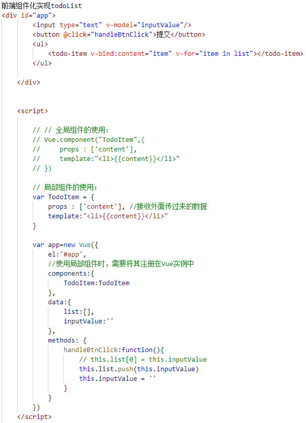

Vue加载运行入口：vue实例（一个根实例）
vue中的每个组件都是vue实例

Vue项目都是由很多个组件（Vue实例）组成的

v- + vue指令 都是 js!!

# MVP模式： Model-View-Presenter  
##  面向dom开发
* M: 模型层
* V：视图
* P（Presenter）：控制器  负责所有业务逻辑

# MVVM模式：Model-View-ViewModel
## 面向数据（M层）开发

# 前段组件化
## 父组件（Vue实例）向子组件传值：
  + ___通过在父组件的template(模板)引入子组件的标签___
  + 使用v-bind + 变量 
  + 子组件记得要接收值！！
  

## 子组件（Vue实例）向父组件传值：
  + 通过$emit来向上一层触发事件
  + 父组件监听（@click 即 v-on）获取子组件所带参数
  
  

## 钩子函数:

 

 

## 钩子函数使用箭头函数中的this不起作用！
+ created() {console.log(this);},
+ created: () => console.log(this)   -->不起作用

