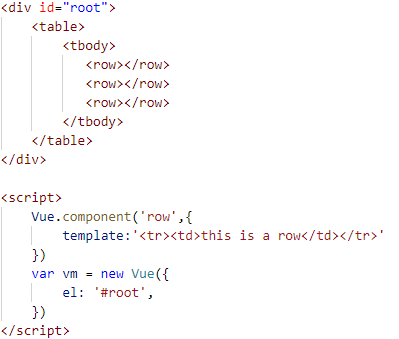
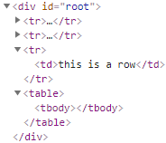
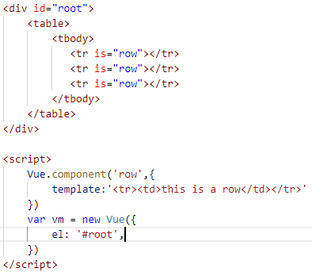
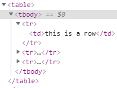
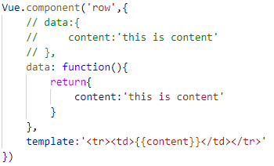
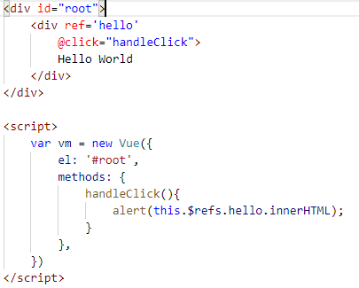
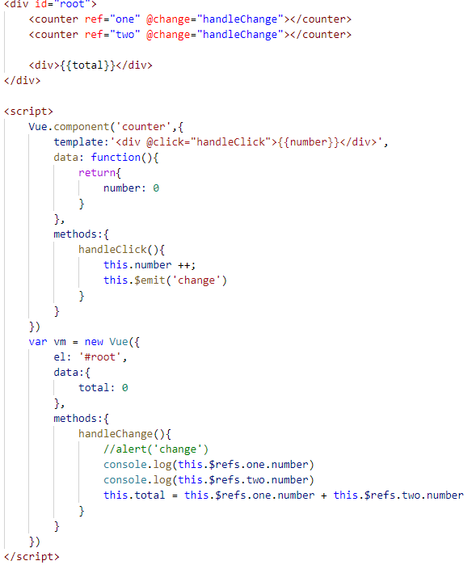
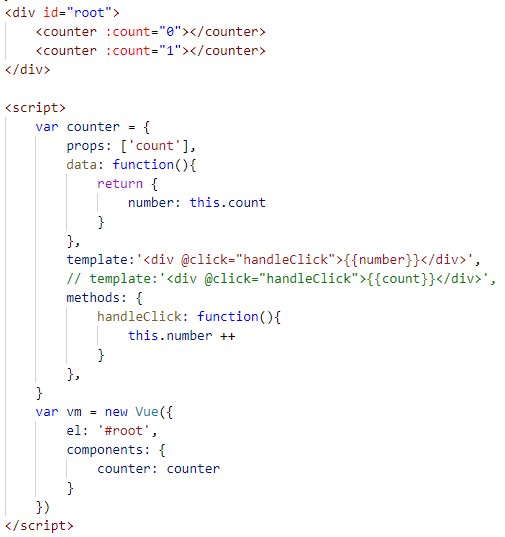
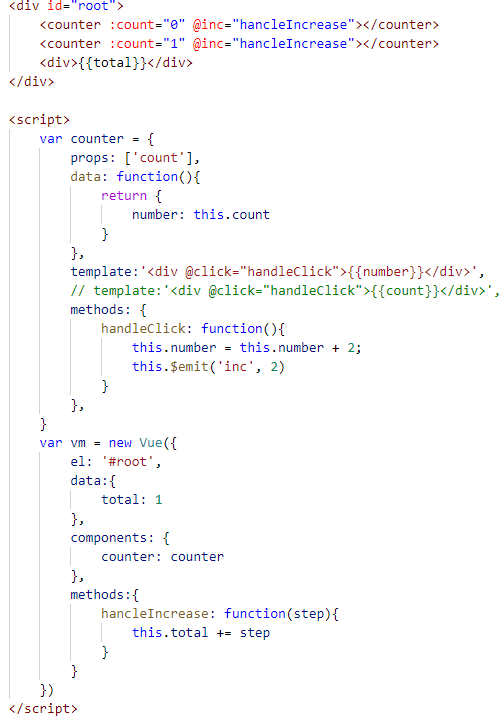

# 使用组件的细节点
## 当使用 table 时，使用 is="row" 属性解决bug 
> + 不直接引用子组件<row标签>！！
> + tr 与 td、ul 与 li、ol、select 与 option
>

>

## 在子组件定义data属性，必须是个函数，而不能是一个对象
> + 因为子组件数据需要被调用多次（父组件数据只被调用一次）
> + 通过一次函数来返回一个对象目的：让每个子组件都拥有一个独立的数据存储，避免多个组互相影响
> + 

## 根组件下使用ref，通过this.$refs获取dom节点元素

## 子组件标签使用ref，通过this.$refs获取子组价的引用
+ 实现计数器功能

# 父子组件的数据传递
## 父通过属性向子传递数据
+ 单项数据流：父可以随意向子传递参数，子只能使用却不能修改父组件传过来的数据
> 解决方法：在子组件使用data将父组件传过来的数据拷贝一份，而后使用自己的data

## 子组件（Vue实例）向父组件传值：
  + 通过$emit来向上一层触发事件
  + 父组件监听（@click 即 v-on）获取子组件所带参数

# 组件参数校验与非props特性

