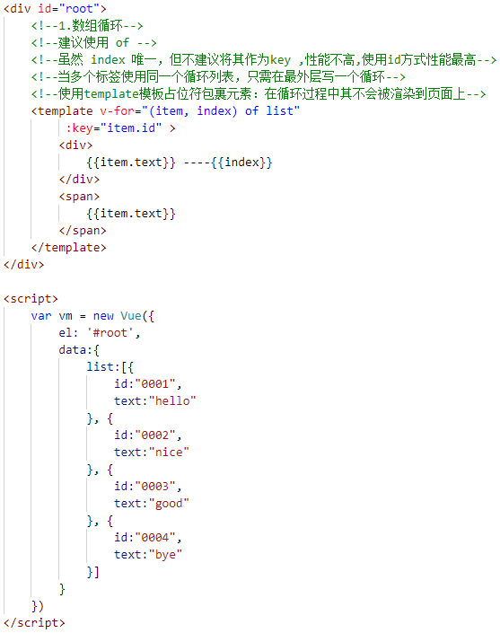

+ 监听事件 ----> v-on:  即 @ （事件都可用 @ 简写）
> + e.g     v-on : click 即  @click
+ v-bind: 即 ：
> + e.g     v-bind: item 即  : item
+ props-->接收外面传过来的数据
+ $emit-->向外触发事件
+ splice( index , 1 )-->从下标为index开始删除一项
  
 
+ vm.$ + 属性或方法   -->获取Vue实例的属性或方法
+ vm.$destroy 销毁Vue实例对象

# Vue模板语法

# 计算属性，方法与侦听器
+ computed
+ method 
+ watch
+ 当一个功能三者都可以实现时，使用 computed : 因为其代码简便且性能较高！！
+ 监听变化 一定用 watch！
+ computed 是取已存在的属性构造新的属性！

# 计算属性的setter和getter

# Vue中的样式绑定 (Class和Style绑定)
+ 通过对象或数组进行绑定 :class 或 ：style

+ 常用：对象的计算属性方式
  

# Vue的条件渲染
> + 不推荐同时使用 v-if 和 v-for

> + 一个模板标签是否在页面显示 ：使用v-show性能高一些
> + v-if：当变量值为false时，该标签就不存在于dom上了
> + v-show：当变量值为false时，该标签依然存在，只不过以display：none存在
 

> + v-if、v-else-if 与 v-else 必须紧贴使用，中间不能有其他标签

+ 用 key 管理可复用的元素
 
+ 在上面的代码中切换 show 将不会清除用户已经输入的内容。因为两个模板使用了相同的元素，
  <input标签> 不会被替换掉——仅仅是替换了它的 placeholder
+ 使用key来标志标签的唯一性，表明两者独立，不要复用他们

# Vue的列表渲染
> 1.数组循环
> + 当多个标签使用同一个循环列表，只需在最外层写一个循环
> + 使用template模板占位符包裹元素作用：在循环过程中其不会被渲染到页面上  ！！！！！
> + 建议使用of 如 item of list
> + 使用key值提高性能，但不建议直接使用数组的index作为key值，建议自定义id，并将其作为key 
> ## 数组更新检测
> + 直接通过数组下标对记录进行改变，不会实时显示在页面上！
> > 例如 vm.list[1]={"id":"0011",text: "nono"} 
> > +通过在页面控制台测试vm.list可查看到列表内容发生改变，但页面并没有更新
> + 解决1：使用变异方法 (mutation method)
Vue 将被侦听的数组的变异方法进行了包裹，所以它们也将会触发视图更新。这些被包裹过的方法包括：
> + push(): 往数组添加一条记录
> + pop()：去除数组最后一项
> + shift()：去除数组第一项
> + unshift()：往数组第一项添加内容
> + splice()：对数组截取
> + sort()： 对数组排序
> + reverse() ：对数组取反
> 
>    在页面控制台测试，然后对前面例子的 items 数组尝试调用变异方法。
> > + 比如 vm.list.splice(1,1,{id:"333",text:"nono"}) :从第二项删除一项，并再次添加新纪录
> 
> + 解决2：直接改变数组引用 
> > + 如在页面控制台输入 vm.list=[{
                        id:"0001",
                        text:"hello"
                    }, {
                        id:"0002",
                        text:"nice11"
                    }, {
                        id:"0003",
                        text:"good"
                    }, {
                        id:"0004",
                        text:"bye"
                    }]
> + 解决3：使用set方法
> > + Vue.set(vm.list,1,{id:"0000",text:"nono"})
> > + vm.set(vm.list,1,{id:"0000",text:"nono"})

 

 

> 2.对象循环
> + (item,key,index)  item:对象中的键值(属性值) ; key:对象中的键名(属性名) index:该属性在对象中的第几个位置
> ## 对象更新检测
> + 直接通过对象对记录进行改变，不会实时显示在页面上！
> > 例如 vm.userInfo.address="beijing"
> > +通过在页面控制台测试vm.userInfo可查看到列表内容发生改变，但页面并没有更新
> + 解决1：可以使用 Vue.set(object, propertyName, value) 方法向嵌套对象添加响应式属性
> > + 在页面控制台输入 Vue.set(vm.userInfo,'address','beijing')
> + 解决2：使用 vm.$set 实例方法，它只是全局 Vue.set 的别名
> >  + 在页面控制台输入 vm.$set(vm.userInfo,'address','beijing')
> + 解决3：直接改变数组引用,可直接在页面看到更新数据
> > + 如在页面控制台输入 vm.userInfo={
                        name:"Astrid",
                        age: 21,
                        gender: "female",
                        salary: "secret",
                        address:"beijing"
                    }
 
 > + 需要为已有对象赋值多个新属性，比如使用 Object.assign() 或 _.extend()
 > > vm.userProfile = Object.assign({}, vm.userProfile, {
     age: 27,
     favoriteColor: 'Vue Green'
     })