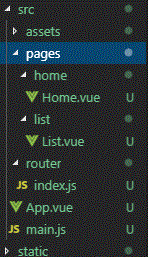
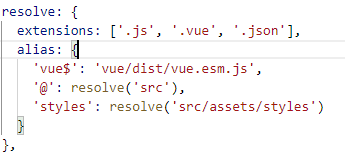
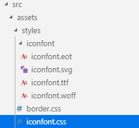
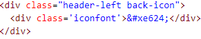
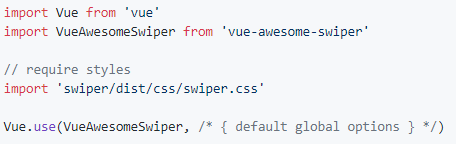
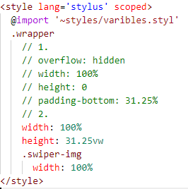

# 单应用组件与路由的使用
+ 以 .vue 结尾的文件都是单组件文件
+ 路由就是根据网址的不同，返回不同的内容给用户
+ <router-view标签/> ：显示的是当前路由地址所对应的内容 
+ App.vue：整个工程的根组件

# 代码结构优化
+ 将src目录下的router的index.js中的 import HelloWorld from '@/components/HelloWorld' 去掉
+ 去掉src目录下的components文件夹

  

# 单页应用vs多页应用
## 多页应用
+ 页面跳转 -->返回 html
+ 优点：首屏时间快，SEO效果好
+ 缺点：页面切换慢
## 单页应用
+ 页面跳转 --> js渲染
+ 优点：页面切换快
+ 缺点：首屏时间稍慢，SEO差

# 样式
+ 在vue项目中导包的路径使用 @ ,表示目录 src 
+ (可在build/webpack.base.conf.js模拟设置自定义路径) 
   
+ e.g: import '@/assets/styles/reset.css' (在main.js中)
+ 样式里面引入样式 用 @import 样式路径要使用 @ 要用 ~ 转义！！
+ e.g: @import '~@/assets/styles/varibles.styl' 
+ varibles.styl 存放全局变量，例如总背景色
## 使用 iconfont
+ 百度搜索 到官方图标库选择图片加入购物车并下载到本地并加入相关文件到项目中
 
+ 在main.js 导入iconfont.css e.g:import 'styles/iconfont.css'
+ 到官网查询相关图表代码并使用
  
 

## 首页轮播图
+ 官网查询相关代码！！
+ github官网搜索 vue-awesome-swiper 第一个 点击 
+ npm install vue-awesome-swiper@2.6.7 --save
+ 使用 在 main.js 加入

 

## 图片宽高自适应（2个方法）
+ 法2可能网站不兼容，常用法1！
+ 防止页面出现抖动 (图片还没加载出来时，不显示图片高度)
+ 网站上查看图片宽高比! 括号里面数值比 e.g:640 : 200 px = 31.25%
+ overflow：hidden    
+ height: 0 !!!
+ padding-bottom: 31.25% 

## 常用颜色
+ #fff 白
+ #eee 灰

## 样式穿透
+ 解决scope局限问题
+ 使用 >>>
+ .wrapper >>> .swiper-pagination-bullet-active
      background: red !important
+ 使 wrapper 下所有子组件的 .swiper-pagination-bullet-active 都为红色

# 图标区域页面布局
  