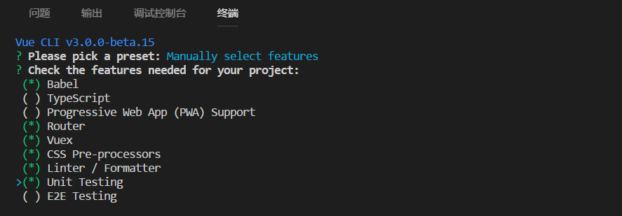

# 使用Vue-cli 3.0搭建Vue项目

> 1. 环境准备
> + 1.1. 安装Node.js （建议使用LTS版本）
> + 1.2 通过npm引入cnpm (cnpm速度较快)
> >npm install -g cnpm --registry=https://registry.npm.taobao.org
> 
> + 1.3 通过cnpm安装Vue——cli脚手架
> >  cnpm install -g @vue/cli

  
> 2. vue-cli搭建脚本文件
> > + 去到目录下 如：cd: d:\vue
> > + 新建一个名为vue_test的Vue前段项目
> > >  vue create vue_test
> >  + 2.1 根据提示进行相应的配置（以手动配置为例）：
> > > 选择Manually select features
> >  + 2.2 选择项目需要的一些特性（此处我们选择需要Babel编译、使用Vue路由、Vue状态管理器、CSS预处理器、代码检测和格式化、以及单元测试，暂时不考虑端到端测试(E2E Testing)）
> > 
> >   + 2.3 配置各种特性
> > 
> > + 2.4 回车
> > +  2.5 下载sass
> >  >cnpm i node-sass

> 3.运行
> >npm run serve